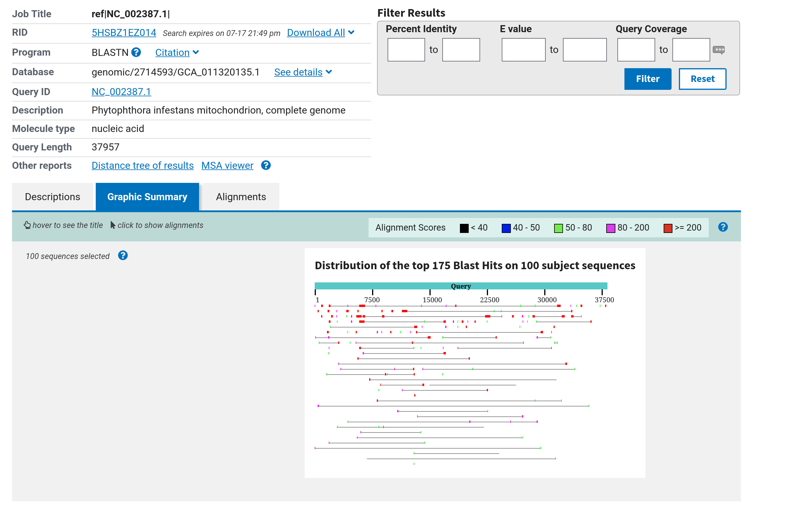

# Rationale for doing a reassembly and reannotation of *Phytophthora betacei*
----

### 1. Trying novel assembly strategies.
Since 2018, when the first assembly was carried out, several improvements and strategies to work with the PacBio sequence data and the supplementary short-read Illumina data have been released. The main points are explained below.

##### 1.1 Reworking the long reads to generate HiFi reads.
The original assembly was done with the Continuous Long Reads (CLRs) subreads via Canu. While this was the state of the art back in the day, [ccs](https://ccs.how/) algorithm, as described in the paper from [Wenger et al. 2019](https://www.nature.com/articles/s41587-019-0217-9), allows for generating HiFi reads from the subreads in a considerable reduced time, thus minimizing pre-assembly noise. This implies that a coverage assessment of the current publicly available reads is necessary for the assembly.

##### 1.2 Separating mitochondrial and nuclear genomes.
One of the issues that came up in the last assembly was the lack of a clear mitochondrial scaffold and some contiguity of mitochondrial genes when compared to RefSeq mitochondrion of *P. infestans* (Accession: NC_002387.1) as seen below  

In otder to address this, assembling separately mitochondrial and nuclear genomes might increase the chance of obtaining a higher quality assembly for the organelle. This can be achieved by using a reference mitochondrial genome, aligning long reads and short reads, and running the assembly workflows separately.

##### 1.3 Using faster and error-aware assemblers.
[NextDeNovo](https://doi.org/10.1186/s13059-024-03252-4), [wtdbg2](https://www.nature.com/articles/s41592-019-0669-3), and [Flye](https://www.nature.com/articles/s41587-019-0072-8) are three error-aware assemblers for long reads released on the years following the original assembly release. They offer a much improved assembly time compared to Canu, which has a very computationally intensive read correction step, while also offering the chance of better handling of the noisy nature of ONT and PacBio reads. Comparing the result from these novel strategies with the current assembly might yield light in the algorithmic and workflow shortcomings from the original work.

##### 1.4 Illumina reads to further correct the reads and the assembly 
The availability of high-coverage Illumina WGS data from the original study offers the opportunity to further correct indel errors derived from the long read sequencing data. The tool [Ratatosk](https://link.springer.com/article/10.1186/s13059-020-02244-4) offers the possibility of correcting long reads before assembly, and Other tools such as [NextPolish2](https://academic.oup.com/gpb/article/22/1/qzad009/7510853) and [POLCA](https://journals.plos.org/ploscompbiol/article?id=10.1371/journal.pcbi.1007981) will help in the downstream process of post-assembly polishing.

##### 1.5 Evaluation criteria, expanded
As a final correction step, [Inspector_protocol](https://www.nature.com/articles/s41596-025-01149-5) will be used to evaluate and correct assembly errors. An overall benchmark of the first assembly release and the new one will be achieved using using [QUAST](https://doi.org/10.1093/nar/gkad406) and [compleasm](https://academic.oup.com/bioinformatics/article/39/10/btad595/7284108), which offer the possibility of calculating QV and a more accurate retrieval of the BUSCOs.

----
### 2. Reannotation using the last decade of knowledge in Phytophthora

##### 2.1 Making the most out of *P. infestans* 1306 and *P. sojae* 2023 assemblies
[Matson et al. 2022](https://journals.plos.org/plospathogens/article?id=10.1371/journal.ppat.1010869) reported the first chromosome-level assembly of *P. infestans*, one of the closest relatives of *P. betacei*. Two years later [Zhang et al. 2024](https://www.nature.com/articles/s41467-024-49061-y) reported the first telomere-to-telomere (T2T) assembly of *P. sojae*. This opens up a unique opportunity to both exploit the annotations of the genomes as a resource to refine gene models of our assembly, as well as a much better tool to update the synteny analysis of *P. betacei*.

##### 2.3 Using state-of-the-art TE pipelines
An important first step before annotating the genome is to mask repetitive and transposable elements which, most of the time, will interfere with the correct inference of gene models and other evolutionary analyses of core genes. The previous strategy relied on the [REPET v.2](https://ieeexplore.ieee.org/document/7562280) pipeline, but it became difficult to configure and run. In later years, tools such as [TransposonUltimate](https://academic.oup.com/nar/article/50/11/e64/6541023?login=true) and [EDTA](https://link.springer.com/article/10.1186/s13059-019-1905-y) offer interesting alternatives to REPET that might be good exploring to annotate transposons and other repeats in the genome.

##### 2.2 Incorporating RNA-seq in the annotation pipeline
The current *P. betacei* annotation was done using [MAKER2](https://link.springer.com/article/10.1186/1471-2105-12-491) pipeline for eukaryotic genomes. These two used mainly protein and transcript alignment-based strategies and HMMs or other algorithms of machine learning to predict the presence of repetitive elements and genes in the assembly. However, there is a public RNA-seq dataset from the organism that has not been exploited to improve and evaluate the annotation. In order to do this, using pipelines such as [BRAKER4](https://genome.cshlp.org/content/34/5/769?implicit-login=true%26273) and [Eukan](https://academic.oup.com/nargab/article/8/1/lqag003/8431146) which use both protein and RNA-seq data will help us to have more accurate gene models. These models and predictions can also be further evaluated in tools such as [GSAman](https://www.cell.com/the-innovation/fulltext/S2666-6758(26)00218-3).

